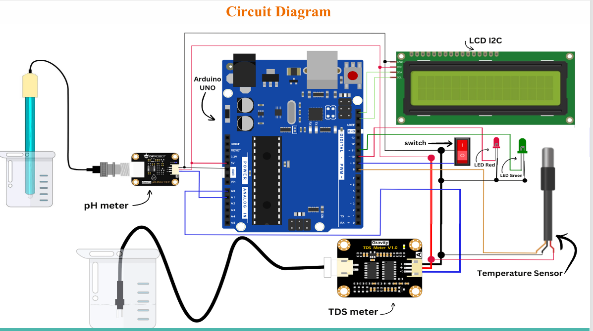

#  Smart Water Quality Monitoring System

## 📖 Project Overview
Fresh water is essential for the survival of all living creatures. Polluted water can cause harmful diseases and even be life-threatening. This project aims to **monitor water quality in real-time** using a smart, non-complex system that provides immediate insights into water safety.

The system leverages a **TDS sensor** to measure the electrical conductivity (EC) and total dissolved solids (TDS) in water, a **DS18B20 temperature sensor** to monitor water temperature, and a **digital pH sensor** to track pH levels. The data is displayed on a **16×2 I2C LCD screen** and indicated with LEDs for quick assessment.

This smart system enables continuous tracking, historical logging, and analysis of water quality, helping identify potential contamination and variations in TDS, EC, and pH over time.

---

## 🏗 Project Architecture

The architecture of the Smart Water Quality Monitoring System is shown below:

---

## 🎬 Project Video

Watch the demonstration video of the Smart Water Quality Monitoring System:  
[Project Video](https://github.com/FarhanaSuci/SmartWaterQualityMonitoringSystem/blob/main/SmartWaterQualityMonitoringSystem.mp4)

---
## ⚙️ Purpose
The purpose of this project is to **assess water quality intelligently and efficiently** without the need for complex lab analysis.  
The system allows users to:
- Measure **Total Dissolved Solids (TDS)**
- Measure **Electrical Conductivity (EC)**
- Monitor **water temperature**
- Measure **pH levels**
- Display results on an **LCD screen**
- Provide immediate **visual feedback** with LEDs for safe or unsafe water

---

## 🧩 Main Features
1. **TDS Measurement**:  
   Measures the concentration of dissolved solids (minerals, salts, metals, and other particles). High TDS indicates more impurities, while low TDS suggests purer water.

2. **Electrical Conductivity (EC) Measurement**:  
   Provides insights into the water’s ability to conduct electricity, which correlates with the concentration of dissolved solids.

3. **pH Measurement**:  
   Tracks the chemical balance of the water by measuring free hydrogen and hydroxyl ions. pH is a key indicator of water quality.

4. **Temperature Monitoring**:  
   Uses a DS18B20 sensor to track water temperature. Temperature affects mineral solubility and microorganism growth, impacting overall water quality.

5. **Real-time Display**:  
   - 16×2 I2C LCD shows TDS, EC, pH, and temperature in real time.  
   - **LED Indicators:**  
     - Red LED → Unsafe water  
     - Green LED → Safe water  

This combination enables **instant assessment of water quality** without the need for additional devices or laboratory analysis.

## To explore full project , please check the Project Video

 

---

